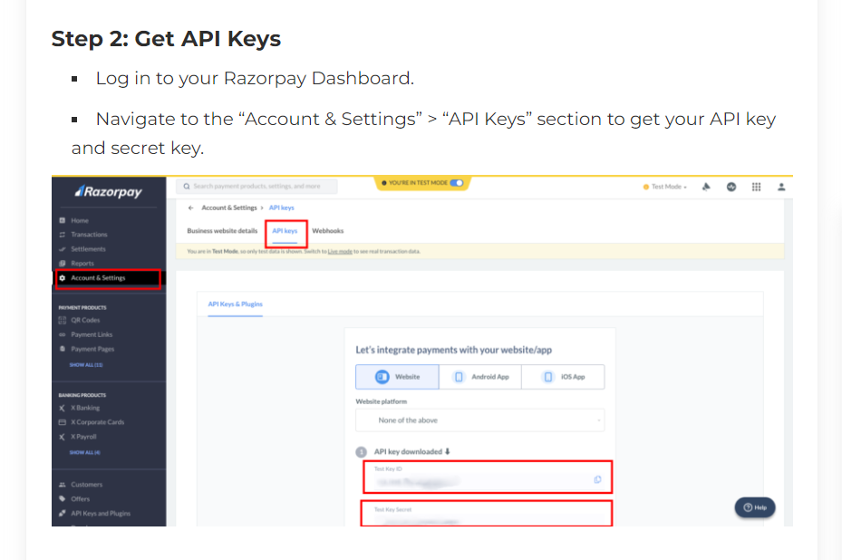

A Step-by-Step Guide: Integrate Razorpay payment gateway to your PHP website

Step 1: Create a Razorpay account
# If you don’t have an account, sign up for a Razorpay account at https://dashboard.razorpay.com/




**`Step 3:` Create your HTML form to get the customer details**
Let’s create a bootstrap normal form to get customer information and amount details.

**Create an `index.php` page and copy and paste the following code into your `index.php` file.**

```html
<!DOCTYPE html>
<html>
    <head>
        <title>How to Integrate Razorpay payment gateway in PHP | tutorialswebsite.com</title>
        <link href="https://maxcdn.bootstrapcdn.com/bootstrap/3.3.7/css/bootstrap.min.css" rel="stylesheet" media="screen">
        <script src="https://ajax.googleapis.com/ajax/libs/jquery/1.12.4/jquery.min.js"></script>
        <script type="text/javascript" src="https://maxcdn.bootstrapcdn.com/bootstrap/3.3.7/js/bootstrap.min.js"></script>
    </head>
    <body style="background-repeat: no-repeat;">
        <div class="container">
            <div class="row">
                <div class="col-xs-12 col-md-12">
                    <div class="panel panel-default">
                        <div class="panel-heading">
                            <h4 class="panel-title">Charge Rs.10 INR  </h4>
                        </div>
                        <div class="panel-body">
                            <div class="form-group">
                                <label>Name</label>
                                <input type="text" class="form-control" name="billing_name" id="billing_name" placeholder="Enter name" required="" autofocus="">
                            </div>
                            <div class="form-group">
                                <label>Email</label>
                                <input type="email" class="form-control" name="billing_email" id="billing_email" placeholder="Enter email" required="">
                            </div>                            
                            <div class="form-group">
                                <label>Mobile Number</label>
                                <input type="number" class="form-control" name="billing_mobile" id="billing_mobile" min-length="10" max-length="10" placeholder="Enter Mobile Number" required="" autofocus="">
                            </div>                            
                            <div class="form-group">
                                <label>Payment Amount</label>
                                <input type="text" class="form-control" name="payAmount" id="payAmount" value="10" placeholder="Enter Amount" required="" autofocus="">
                            </div>	
                            <button  id="PayNow" class="btn btn-success btn-lg btn-block" >Submit & Pay</button>                        
                        </div>
                    </div>
                </div>
            </div>
        </div>
    </body>
</html>

